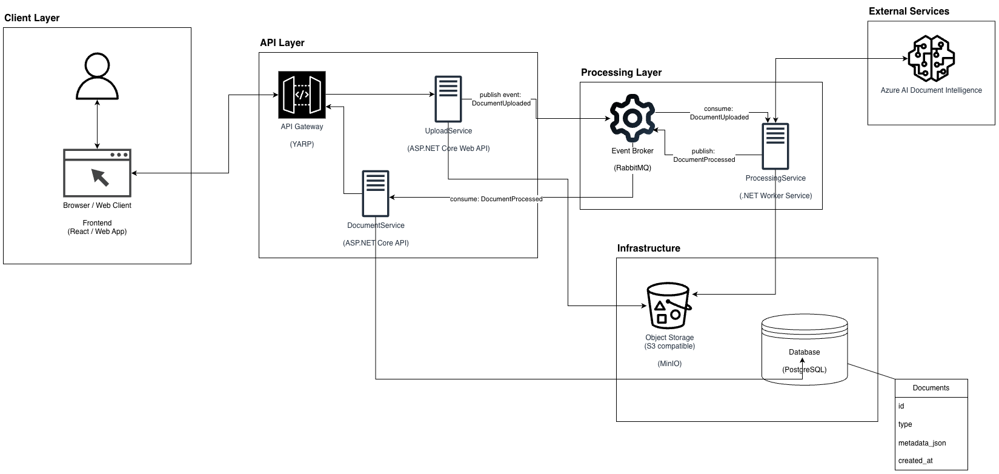

# AI Document Processing Platform

### Lean Microservices System (.NET)

---

### Project Overview

**AI Document Processing Platform** is a microservices-based backend system designed to automatically process uploaded documents (such as invoices or PDFs) using **AI OCR** and extract structured data.

The project demonstrates **event-driven architecture**, asynchronous processing, and integration with external AI services. It is designed as a **lean, production-style system** that showcases modern backend practices used in real-world distributed applications.

---

### System Architecture

---

### Technologies Used

#### Backend
* **.NET 8 (C#)** – Core backend framework
* **Entity Framework Core** – ORM for database operations
* **MassTransit** – Messaging abstraction for RabbitMQ
* **Polly** – Retry and resilience policies

#### Infrastructure
* **PostgreSQL** – Relational database with Full-Text Search
* **RabbitMQ** – Event bus for service communication
* **MinIO** – S3-compatible object storage for documents
* **Docker Compose** – Local microservices infrastructure

#### AI & Frontend
* **Azure AI Document Intelligence** – OCR and document data extraction
* **React + Vite** – Lightweight frontend interface
* **YARP Gateway** – Unified API entry point

---

### Key Features

#### Document Upload
* **File Upload API:** Upload PDF documents through a single endpoint.
* **Object Storage:** Files are stored in MinIO.
* **Event Publishing:** Upload triggers a `DocumentUploaded` event.

#### AI Processing
* **Background Worker:** Processing service consumes events from RabbitMQ.
* **AI Integration:** Documents are analyzed using Azure Document Intelligence.
* **Structured Data:** Extracted metadata (e.g. amount, date, vendor) is parsed from AI responses.

#### Data Storage & Search
* **Metadata Storage:** Processed documents saved in PostgreSQL.
* **Full-Text Search:** Built-in PostgreSQL search replaces Elasticsearch.
* **Processing Status:** Documents tracked as `Processing` or `Completed`.

---

### System Architecture

* **Microservices Architecture:** Upload, Processing, and Document services operate independently.
* **Event-Driven Communication:** Services communicate via RabbitMQ events.
* **API Gateway:** YARP routes requests from frontend to backend services.
* **Asynchronous Processing:** AI processing runs in background workers.
